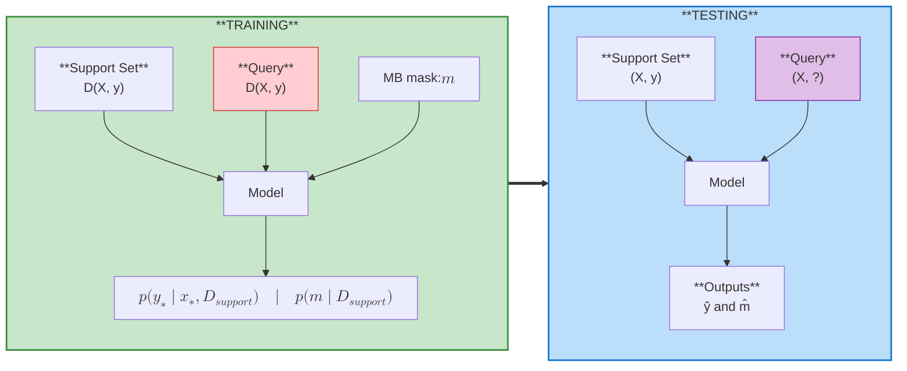

# GG

The journey comes to an end. Congratulations to all teams for making it this far!

## :trophy: Leaderboard

| Rank | Group | Members           | Final Score (↓) |
| :--: | :---: | ----------------- | :-------------: |
| :1st_place_medal: 1 | 10    | Ang, Muhammed     |    **0.194036** |
| :2nd_place_medal: 2 | 8     | Fredo, Anton      |     0.208636    |
| :3rd_place_medal: 3 | 7     | Dhruv, Sahajpreet |     0.280585    |
| :medal_sports: 4 | 1     | Sameera, Tanmayi  |     0.304475    |

At a high level, all teams achieved similar RMSE, so the leaderboard is primarily driven by the
Jaccard score, i.e., the quality of Markov blanket discovery.

The first-place submission stands out by reaching an average Jaccard above 0.7,
but with noticeably higher variance across tasks.

One likely contributor to this high standard deviation is the use of a fixed 0.5
threshold to binarize Markov blanket probabilities;
tuning this threshold on a validation set could further improve stability and overall performance.

The second-place submission treats prediction and Markov blanket discovery as two
separate tasks, so its RMSE can be interpreted as an "all-features" baseline.

Teams 7 and 1 instead use the predicted Markov blanket for prediction, which leads
to slightly higher RMSE than the all-feature baseline.
This highlights how sensitive predictive performance can be to the quality of Markov blanket discovery.

## Team Roster

| Group | Members | Repo | Submission File |
|-------|---------|------|-----------------|
| 1 | Sameera, Tanmayi | [sameerashahh/CSE472-blanket-challenge](https://github.com/sameerashahh/CSE472-blanket-challenge/tree/project2_implementation) | [`final_project_implementation/submission.csv`](https://raw.githubusercontent.com/sameerashahh/CSE472-blanket-challenge/486287884d7099c273a570a16aec4d387f60320e/final_project_implementation/submission.csv) |
| 7 | Dhruv, Sahajpreet | [dhruvb26/CSE472-blanket-challenge](https://github.com/dhruvb26/CSE472-blanket-challenge/tree/main) | [`solution/runs/20251124_194116/submission.csv`](https://raw.githubusercontent.com/dhruvb26/CSE472-blanket-challenge/b8c8ca86d3f6d0aa97ba79cd1f6d73ca57018c50/solution/runs/20251124_194116/submission.csv) |
| 8 | Fredo, Anton | [saan-volta/CSE472-blanket-challenge-submission](https://github.com/saan-volta/CSE472-blanket-challenge-submission/tree/main) | [`submission/submission.csv`](https://raw.githubusercontent.com/saan-volta/CSE472-blanket-challenge-submission/942d6b74e42ec51330fdfc8505c992db356819cf/submission/submission.csv) |
| 10 | Ang, Muhammed | [muhammedhunaid/CSE472-blanket-challenge](https://github.com/muhammedhunaid/CSE472-blanket-challenge/tree/muhammed/final-submission) | [`submission.csv`](https://raw.githubusercontent.com/muhammedhunaid/CSE472-blanket-challenge/refs/heads/muhammed/final-submission/submission.csv) |

## Evaluation

We evaluate the model on a set of $N$ unseen tasks $\{\mathcal{T}_j\}_{j=1}^N$ at test time.

For each task $\mathcal{T}_j$, the dataset is split into a support set and a query set:

- **Support Set**: $\mathcal{D}^{(j)}_{support} = \{(x_i, y_i)\}_{i=1}^k$
- **Query Set**: $\mathcal{D}^{(j)}_{query} = \{(x_i, y_i)\}_{i=1}^{N_{query}}$

and the model predicts:

1. The target values $\hat{y}$ for samples in $\mathcal{D}^{(j)}_{query}$.
2. The Markov Blanket mask $\hat{m}^{(j)} \in \{0, 1\}^d$.

### Submission file

On the submission dataset, for each dataset (`data_id`), predict both `y` and
`markov_blanket`, and save results in `submission.csv` with the following format:

| data_id | y_pred                    | markov_blanket_pred      |
| ------- | ------------------------- | ------------------------ |
| int     | list of float; shape (n,) | list of int;  shape (d,) |

### Metrics

The performance is measured using two metrics:

1. **Root Mean Squared Error (RMSE)** (Lower is better):
   $$ \text{RMSE}_j = \sqrt{\frac{1}{N_{query}} \sum_{(x, y) \in \mathcal{D}^{(j)}_{query}}
   (y - \hat{y}(x))^2} $$
   We report the average RMSE over all $N$ tasks:
   $$ \overline{\text{RMSE}} = \frac{1}{N} \sum_{j=1}^N \text{RMSE}_j $$

2. **Jaccard Score** (Higher is better):
   Measures the overlap between the predicted Markov Blanket $\hat{m}^{(j)}$ and the true
   Markov Blanket $m^{(j)}_{true}$.
   $$ \text{Jaccard}_j = \frac{|\hat{m}^{(j)} \cap m^{(j)}_{true}|}{|\hat{m}^{(j)}
   \cup m^{(j)}_{true}|} $$
   We report the average Jaccard score over all $N$ tasks:
   $$ \overline{\text{Jaccard}} = \frac{1}{N} \sum_{j=1}^N \text{Jaccard}_j $$

### Final Score

The final score combines regression performance and feature selection accuracy.

$$ \text{Score} = \overline{\text{RMSE}} \times (1 - \overline{\text{Jaccard}}) $$

**Lower score is better.**
